# Newts Server Control Panel (NSCP)
A standalone Linux-based Minecraft server management panel featuring backups, scheduling, live console, RCON player tracking, plugin manager, file explorer, text editor, and more.

## Features
- Web dashboard for real-time server monitoring
- Start/stop controls with auto-restart
- Full console streaming + command input
- Backup system with retention management
- Scheduler for automated commands
- Discord webhook integration
- RCON-powered player list + join history
- Player management (op/deop, whitelist)
- File manager with upload/download/delete
- Built-in text editor (.yml, .json, .txt, .md, .properties)
- Plugin manager (enable/disable `.jar.disabled`)
- server.properties editor
- License acceptance gate (scroll-to-accept)
- Hardware usage (CPU/RAM/Disk) monitoring

## Requirements
- Python 3.9+
- pip
- Linux OS
- Bash
- Minecraft server jar (Paper/Spigot/Purpur/etc.)
- systemd
- RCON enabled

## Installation Guide

### 1. Extract NSCP
Place the folder somewhere permanent:
```
/DATA/AppData/crafty/servers/<server-id>/nscp2.0
```

### 2. Configure config.yml
(Edit panel, server_dir, start_command, backups, webhook, etc.)

### 3. Allow Execution of runcp.sh
```
chmod +x runcp.sh
```

### 4. Install Dependencies
#### <red style="color:orange">*only required if you dont use the launch script*</red>
```
pip install -r requirements.txt
```

### 5. Enable RCON
Add to server.properties:
```
enable-rcon=true
rcon.port=25575
rcon.password=<your_password>
```

### 6. Configure systemd Service
Create `/etc/systemd/system/nscp.service`
if you're unsure of how to assemble a basic service unit, feel free to reach out to me via discord and i can assist in getting one up and running for you

### 7. First Launch
Visit http://<your-ip>:8081, accept EULA, login, configure panel.

## Need Help?
Join My Discord: http://discord.newt-tech.com

# Gallery

<details>
  <summary>Login Page</summary>

  ## Login  
  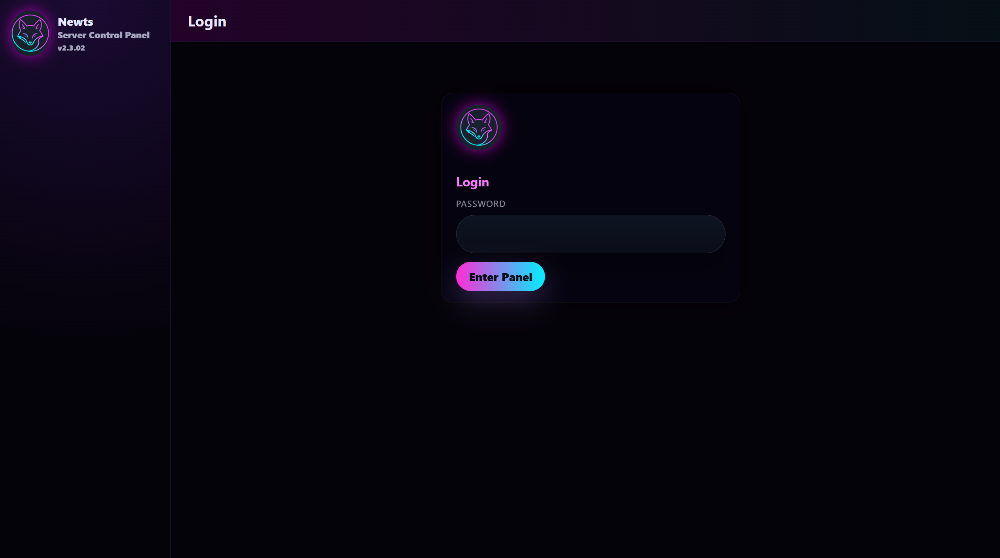
</details>

<details>
  <summary>Dashboard</summary>

  ## Dashboard  
  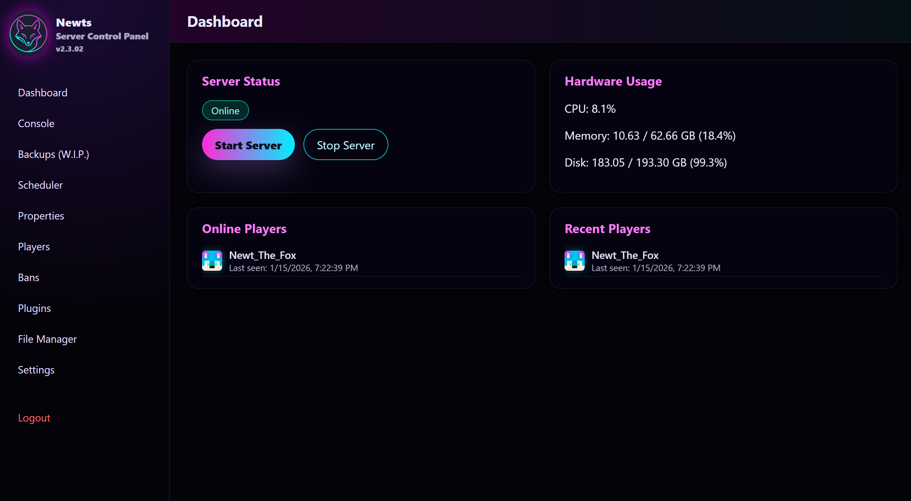
</details>

<details>
  <summary>Console</summary>

  ## Console  
  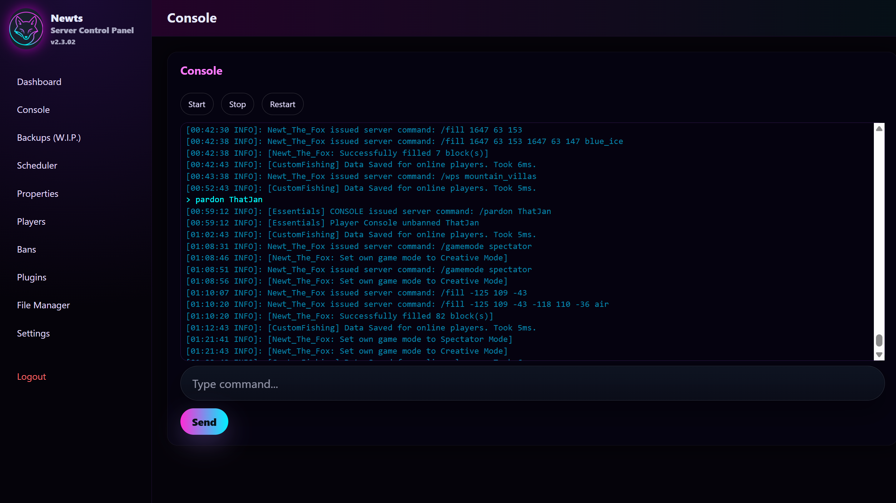
</details>

<details>
  <summary>Backups</summary>

  ## Backups  
  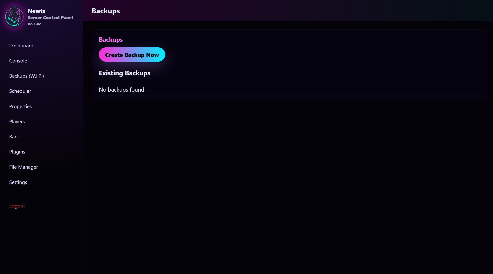
</details>

<details>
  <summary>Scheduler</summary>

  ## Scheduler  
  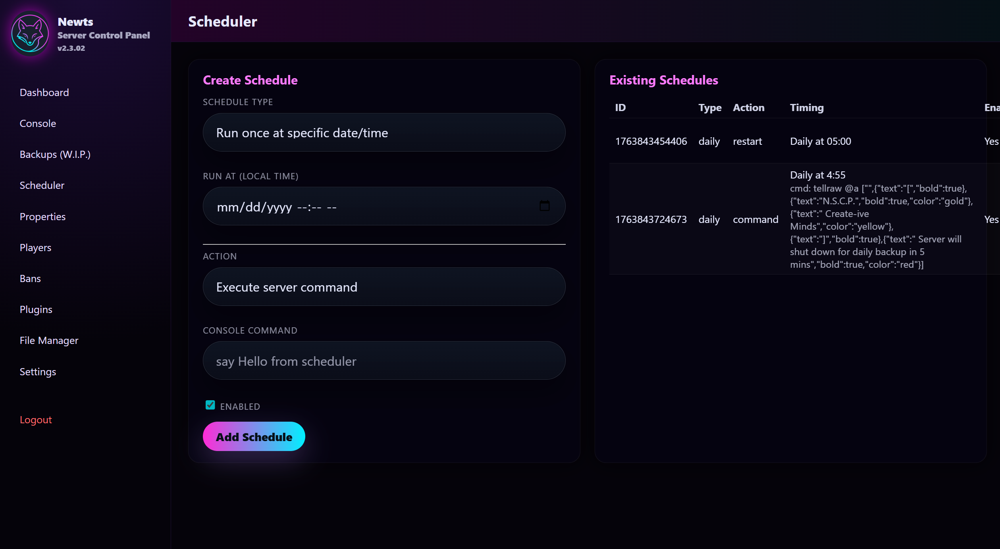
</details>

<details>
  <summary>Properties</summary>

  ## Properties  
  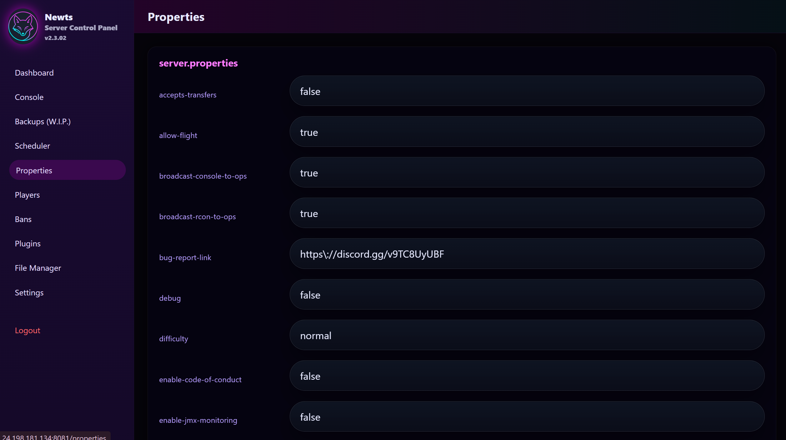
</details>

<details>
  <summary>Players</summary>

  ## Players  
  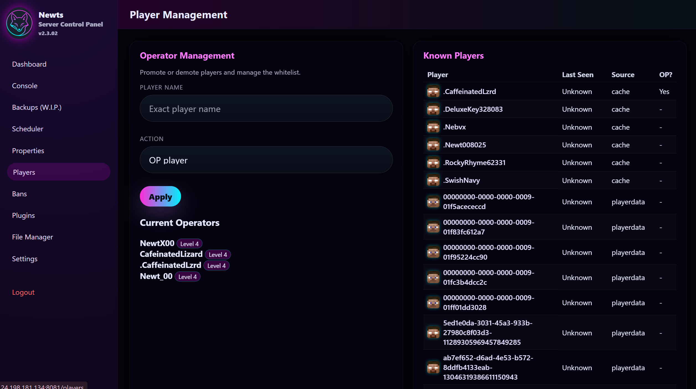
</details>

<details>
  <summary>Bans</summary>

  ## Bans  
  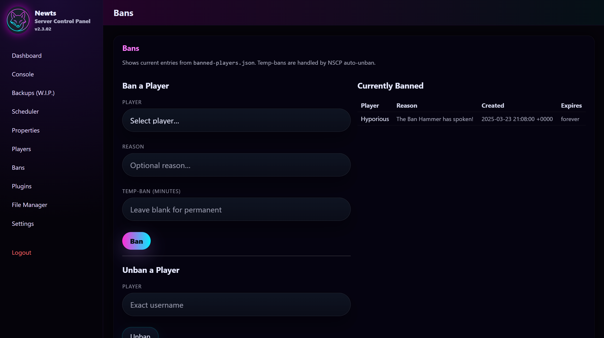
</details>

<details>
  <summary>Plugins</summary>

  ## Plugins  
  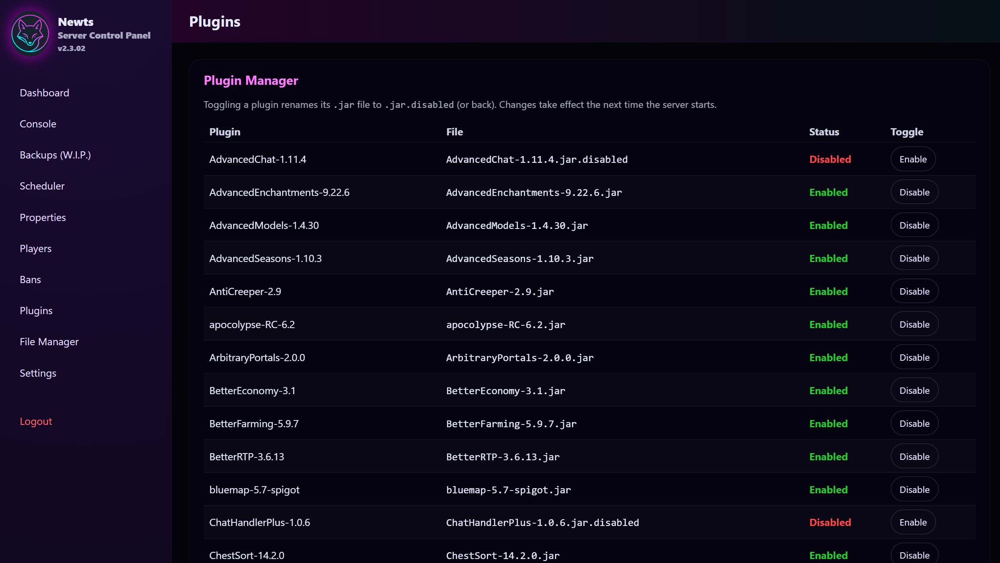
</details>

<details>
  <summary>File Manager</summary>

  ## File Manager  
  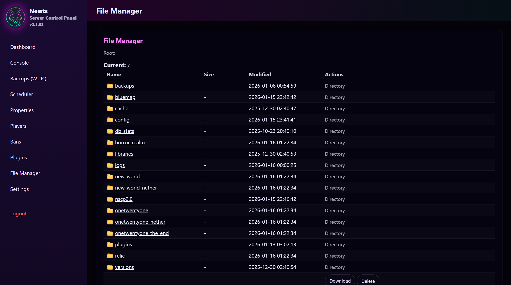
</details>

<details>
  <summary>Settings</summary>

  ## Settings  
  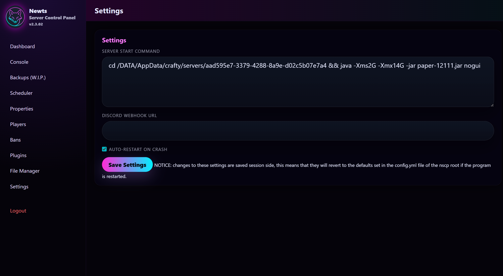
</details>
